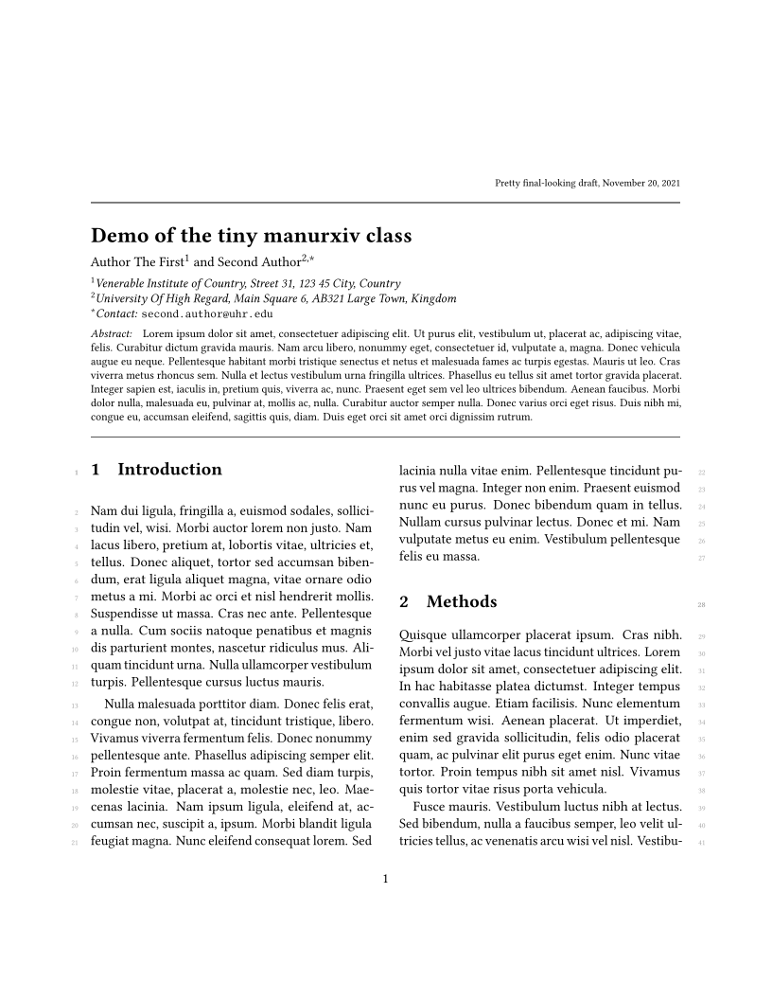
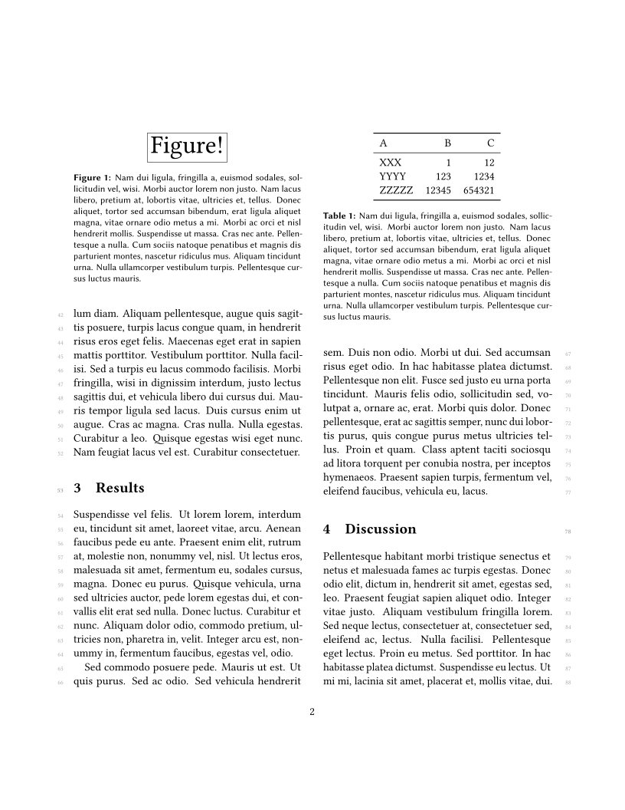

# `manurxiv.cls` for pretty nice manuscript drafts

The class `manurxiv.cls` summarizes several adjustments and macros that I use
quite often for typesetting manuscript drafts and "publisher-agnostic" paper
versions for arxiv-style sites.

Mainly, it typesets a nice block of title, authors, affiliations and abstract,
and continues basically just as the `article` class.

To see the result, run:
```sh
latexmk demo
```

In the two-column version it looks like this:

